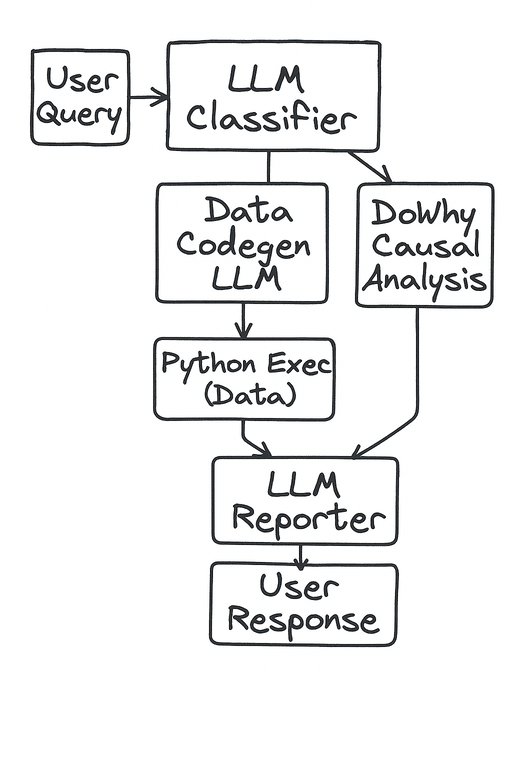

# pine_labs_insights
# Business Assistant API

A FastAPI-based business intelligence assistant that processes natural language queries and provides data-driven insights using OpenAI's GPT models.


## DAG





[DoWhy-GCM Causal Inference](https://arxiv.org/abs/2206.06821)

https://medium.com/data-science/using-causal-graphs-to-answer-causal-questions-5fd1dd82fa90

## Features

- **Natural Language Processing**: Ask business questions in plain English
- **Intelligent Query Classification**: Automatically categorizes questions as causal analysis, insight analysis, or general queries
- **KPI Extraction**: Identifies relevant Key Performance Indicators from business questions
- **Data Analysis Pipeline**: Executes Python code to analyze business data and generate insights
- **RESTful API**: Easy-to-use HTTP endpoints for integration

## Project Structure

```
pine_labs_insights/
├── api.py                 # Main FastAPI application
├── backend/              
│   ├── pipeline.py       # Core business analysis pipeline
│   ├── assistant.py      # OpenAI assistant integration
│   ├── execute_llm.py    # LLM execution utilities
│   └── prompts.py        # AI prompt templates
├── data/
│   └── data_cleaned.csv  # Cleaned transaction data
├── requirements.txt      # Python dependencies
└── README.md
```

## Setup

1. Clone the repository:
```bash
git clone https://github.com/harkiratmakkar/pine_labs_insights.git
cd pine_labs_insights
```

## Create and activate a virtual environment:
```bash
python -m venv .venv
source .venv/bin/activate  # On Windows: .venv\Scripts\activate
```

## Install dependencies:
```bash
pip install -r requirements.txt
```

## Set up environment variables:
Create a `.env` file in the root directory:
```
OPENAI_API_KEY=your_openai_api_key_here
```

## Run the API server:
```bash
python api.py
```

The API will be available at `http://localhost:8000`

## API Endpoints

### GET /
Health check endpoint

### POST /get-cards-data
Get basic merchant transaction insights
```json
{
  "merchant": "Merchant A"
}
```

### POST /query
Run natural language business queries with causal analysis
```json
{
  "question": "What caused the change in refund amounts?",
  "merchant": "Merchant A", 
  "time_period": "yesterday"
}
```

## Key Components

- **BusinessAssistant**: Main class handling question classification and causal analysis
- **DataAnalysisAssistant**: OpenAI assistant integration for detailed data analysis
- **Causal Analysis**: Uses DoWhy library for causal inference on transaction data
- **Question Classification**: AI-powered categorization of business questions

## Dependencies

Key libraries used:
- FastAPI - Web framework
- OpenAI - AI/LLM integration
- DoWhy - Causal inference
- Pandas - Data manipulation
- NetworkX - Graph analysis
- Scikit-learn - Machine learning utilities

## Usage Example

```python
import requests

# Get basic merchant insights
response = requests.post("http://localhost:8000/get-cards-data", 
                        json={"merchant": "Merchant A"})
print(response.json())

# Ask a business question
response = requests.post("http://localhost:8000/query", 
                        json={
                            "question": "What factors influenced settlement amounts?",
                            "merchant": "Merchant A",
                            "time_period": "yesterday"
                        })
print(response.json())
```

## License

This project is licensed under the MIT License.
